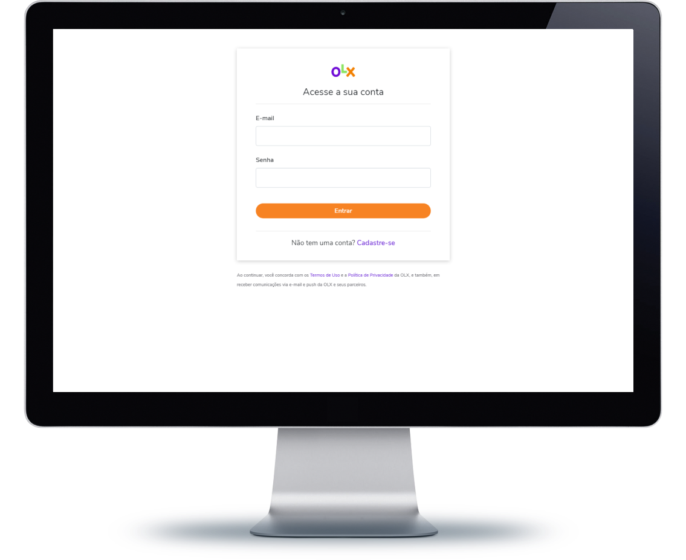
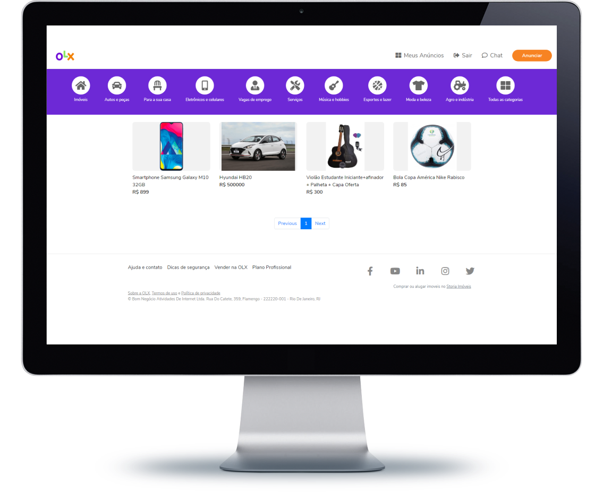
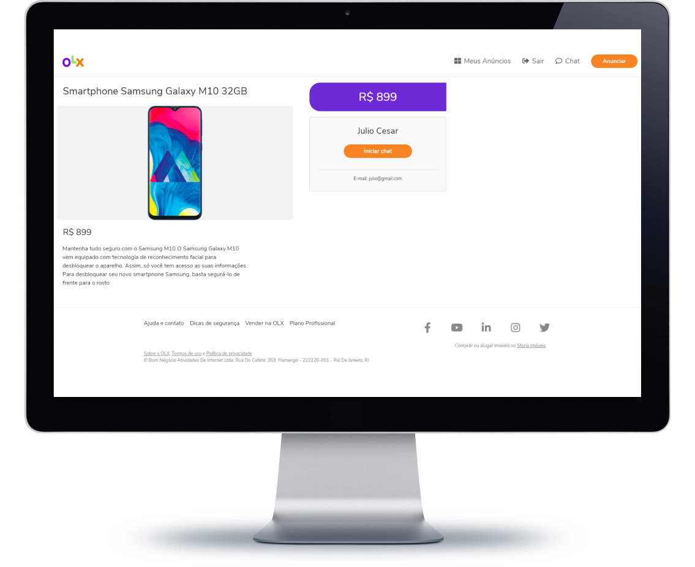
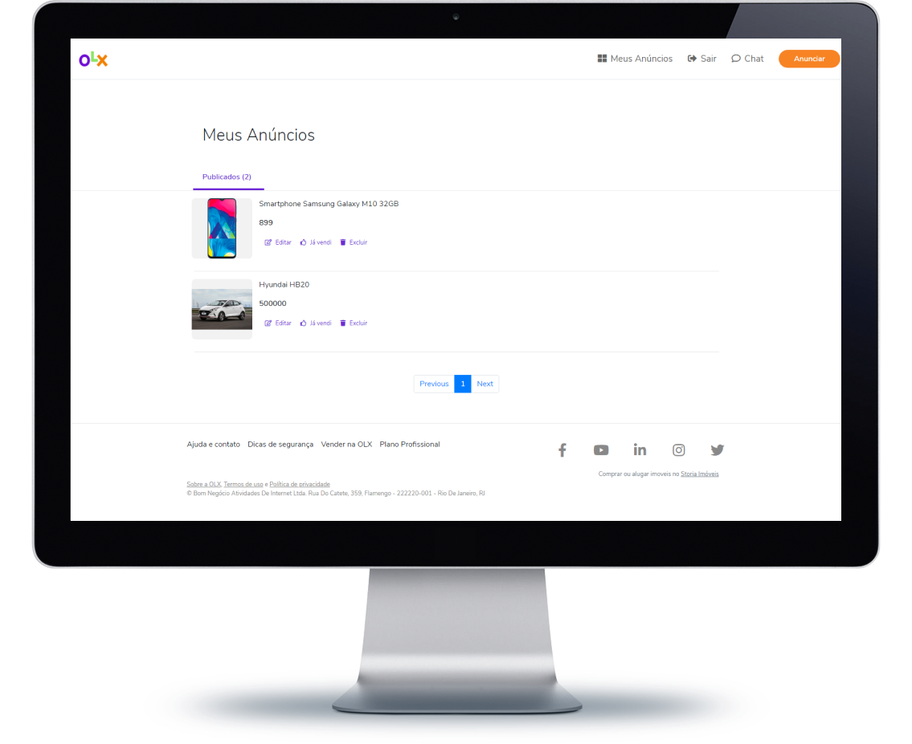

# Projeto copia do OLX

###### Uma cópia das main features do OLX com foco no aprendizado da MERN Stack.

#

### Backend: Node.js, Express, Mongo DB 

### Frontend: ReactJS, Bootstrap, CSS3

#

### Main Features:
**SignIn/SignUp, Upload de Fotos, Rotas autenticadas, Paginação, CRUD de produtos, Responsividade.**

## Tela de Login

## Tela Home

## Tela Detalhes Do Produto

## Tela Dashboard

